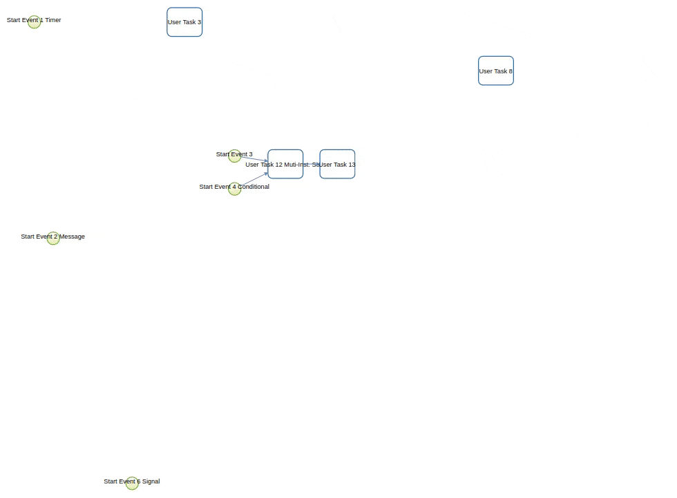

# Generate screenshots of BPMN Diagram rendering for various `bpmn-visualization` versions

  
_B.2.0 rendering evolutions with `bpmn-visualization` from version 0.1.0 to 0.10.0 as shown in the [bpmn-visualization 1st anniversary article](https://dev.to/process-analytics/the-bpmn-visualization-project-celebrates-its-1st-anniversary-4ae2)_


**NOTES**:
* currently, only retrieve the `B.2.0` file (could be passed as url parameter)
* this is a first implementation, a lot of things could be improved (script robustness, html elements waiting conditions, code duplication, ...)
* the resources used for bpmn-visualization until version 0.3.0 (including) are taken from the history of the bpmn-visualization-examples
repository

## How it works

Pages are available for most `bpmn-visualization` versions. They load reference diagrams from the master branch of the
[bpmn-miwg-test-suite](https://github.com/bpmn-miwg/bpmn-miwg-test-suite) repository on page load.
A nodejs script can generate screenshot thanks to a playwright script. It opens the pages in a Chromium browser and takes
screenshots.

## How to do the screenshots generation

### Prerequisites

`node.js`: see [.nvmrc](./.nvmrc). `nvm` users can run `nvm use`.

Run `npm install`

### How-to

Start an HTTP server on port `8002`, for instance, by running one of the following commands
- `python3 -m http.server 8002`
- `npx http-server --port 8002`

Run `node index.js` (it may not stop correctly).

Screenshots are generated in the `build/screenshots` directory


## Tips to generate video/gif from screenshots

**NOTE**: this solution relies on `ffmpeg` and an internet services. This is subject to improvements.

Generate video
```bash
ffmpeg -framerate 1 -pattern_type glob -i '*.png' -r 30 -pix_fmt yuv420p -vf scale=1280:-1 video.mp4
```

Generate GIF from the video
inspirations
* https://bhupesh-v.github.io/convert-videos-high-quality-gif-ffmpeg/
* see also https://superuser.com/a/556031 for an attempt to generate the 'palette' on the fly

```bash
# generate a palette
ffmpeg -i video.mp4 -vf "fps=22,scale=1280:-1:flags=lanczos,palettegen" palette.png
# use the generated palette
ffmpeg -i video.mp4 -i palette.png -filter_complex "fps=22,scale=1280:-1:flags=lanczos[x];[x][1:v]paletteuse" output.gif
```

Improve the GIF (with https://ezgif.com/)
* crop (use Gifsicle): this could be avoid if custom viewport dimensions where set when doing the screenshots 
* optimize
  * method: Lossy GIF
  * compression: 35


## Resource details

Custom html page have been created to use `bpmn-visualization`
* the IIFE bundle is used when available. It is retrieved from a CDN exposing npm package bundles.
* otherwise, we used the demo bundle/packaging, and custom code to make the integration work

See the `./resources` directory for more details.

Resources are provided for versions from 0.1.0 to 0.14.0 when new BPMN support is provided
Versions not provided because no BPMN support change (info from 0.1.0 to 0.14.0 - the latest version available when implementing the solution)
* 0.4.0
* 0.8.0 and 0.9.0
* 0.11.0 to 0.14.0

Note that 0.5.0 add support for business rules task and compensation event.
These BPMN elements are not present in B.2.0 so no visible change with 0.3.0.


### Technical notes

Versions that need a http server (bpmn-visualization provided as ES Module, use imports in module script)
to make the js code work
* 0.2.0
* 0.3.0

Errors in the console (can be skipped) before 0.2.0 (due to [demo code does not interfere with lib integration](https://github.com/process-analytics/bpmn-visualization-js/pull/479),
fixed in 0.2.0)
```
Uncaught TypeError: document.getElementById(...) is null
```

0.1.6 hack (see sources for more details), due to an issue in the lib, the whole public API code is minified (see https://github.com/process-analytics/bpmn-visualization-js/pull/461)
